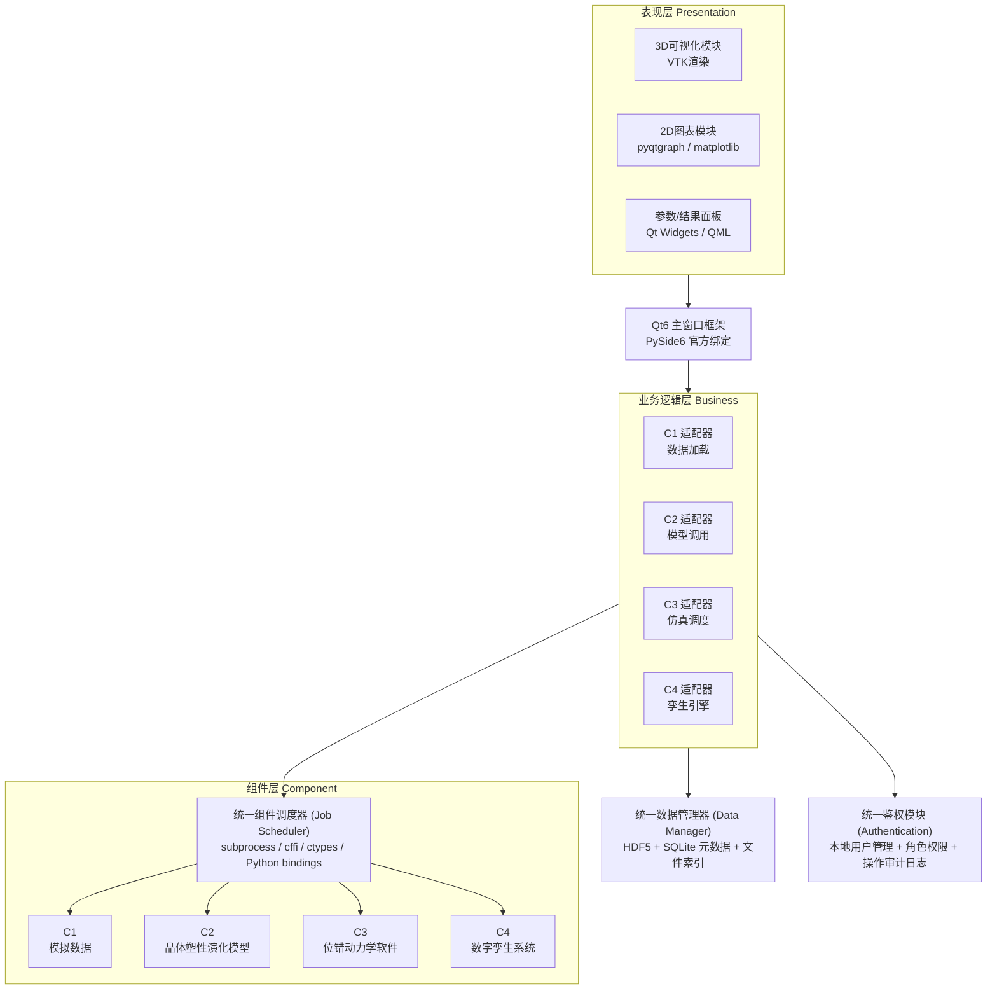
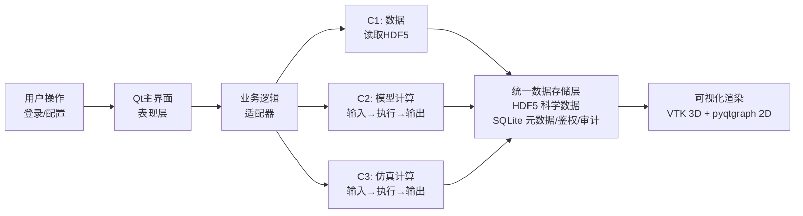
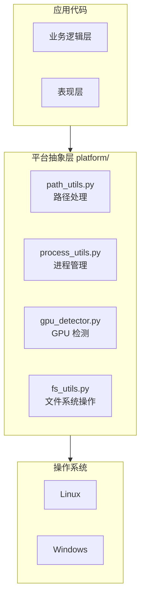
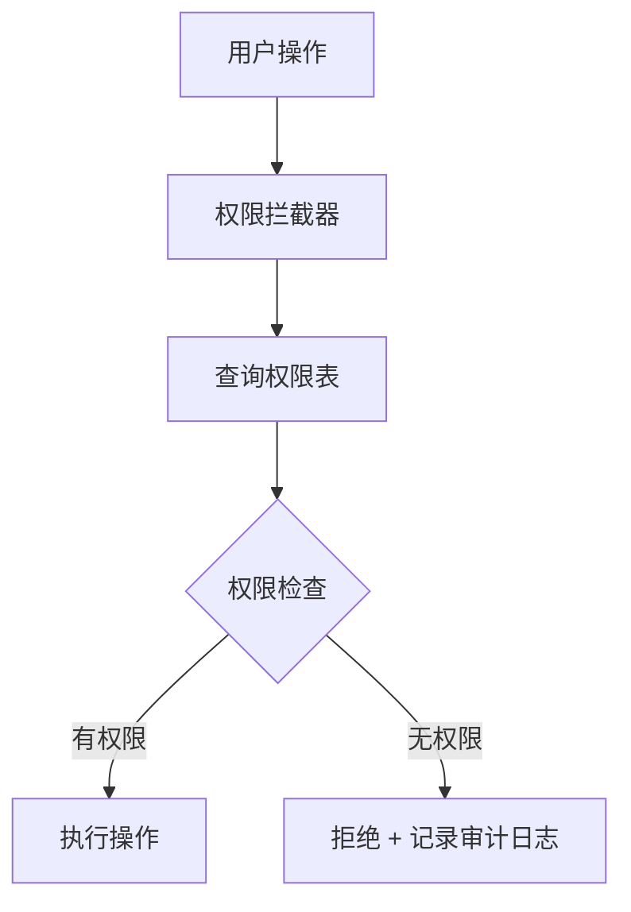
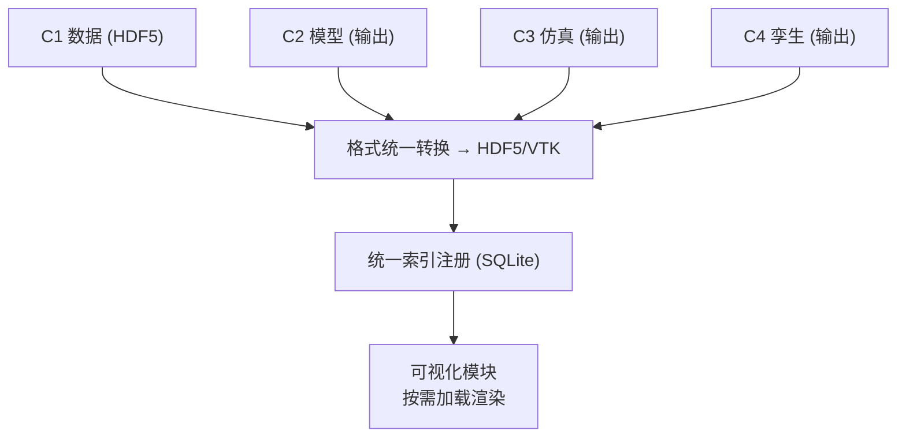
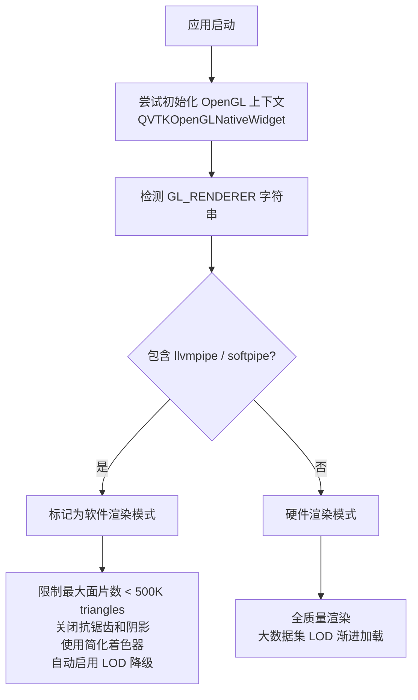
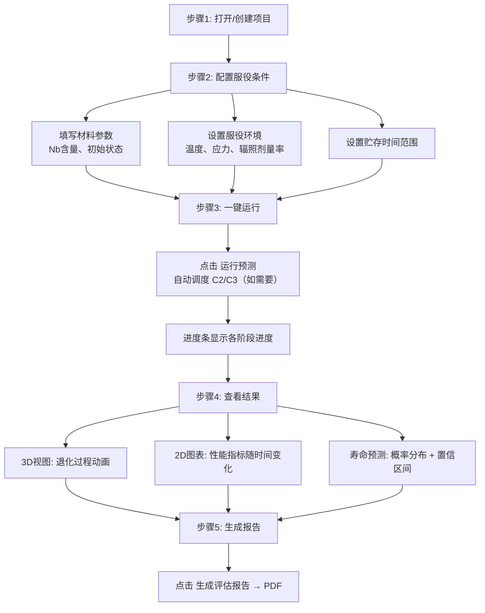
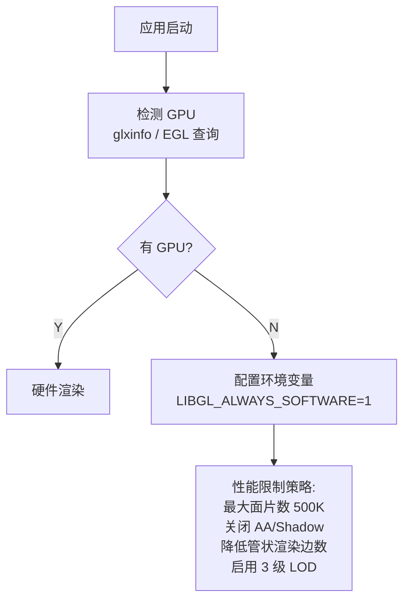

# X铌合金力学性能退化三维数字孪生集成平台
# 设计与实施方案

> 版本: v1.0 | 日期: 2026-04-02 | 状态: 待评审

---

## 目录

- [第一章 项目背景](#第一章-项目背景)
  - [1.1 课题来源](#11-课题来源)
  - [1.2 课题研究内容](#12-课题研究内容)
  - [1.3 课题核心目标](#13-课题核心目标)
  - [1.4 跨尺度模拟框架](#14-跨尺度模拟框架)
  - [1.5 材料数字孪生架构](#15-材料数字孪生架构)
  - [1.6 数据库建设进展](#16-数据库建设进展)
  - [1.7 当前研究难点](#17-当前研究难点)
  - [1.8 与本集成平台的关系](#18-与本集成平台的关系)
- [第二章 项目定义](#第二章-项目定义)
  - [2.1 项目目标](#21-项目目标)
  - [2.2 约束条件](#22-约束条件)
  - [2.3 用户画像](#23-用户画像)
- [第三章 总体架构设计](#第三章-总体架构设计)
  - [3.1 架构风格](#31-架构风格)
  - [3.2 数据流图](#32-数据流图)
  - [3.3 可扩展性设计](#33-可扩展性设计)
  - [3.4 跨平台设计](#34-跨平台设计)
- [第四章 技术栈选型](#第四章-技术栈选型详细论证)
  - [4.1 GUI框架选型](#41-gui框架选型)
  - [4.2 3D渲染引擎选型](#42-3d渲染引擎选型)
  - [4.3 2D图表库选型](#43-2d图表库选型)
  - [4.4 数据存储选型](#44-数据存储选型)
  - [4.5 组件调用方式选型](#45-组件调用方式选型)
  - [4.6 软件渲染兜底方案](#46-软件渲染兜底方案)
  - [4.7 打包部署选型](#47-打包部署选型)
- [第五章 组件集成策略](#第五章-组件集成策略)
  - [5.1 通用适配器模式](#51-通用适配器模式)
  - [5.2 各组件集成方案](#52-各组件集成方案)
- [第六章 鉴权功能设计](#第六章-鉴权功能设计)
  - [6.1 鉴权需求分析](#61-鉴权需求分析)
  - [6.2 角色权限矩阵](#62-角色权限矩阵)
  - [6.3 鉴权架构](#63-鉴权架构)
  - [6.4 鉴权数据存储](#64-鉴权数据存储)
  - [6.5 密码安全策略](#65-密码安全策略)
  - [6.6 权限拦截机制](#66-权限拦截机制)
- [第七章 数据管理设计](#第七章-数据管理设计)
  - [7.1 统一数据模型](#71-统一数据模型)
  - [7.2 存储架构](#72-存储架构)
  - [7.3 数据流转图](#73-数据流转图)
- [第八章 可视化实现详案](#第八章-可视化实现详案)
  - [8.1 VTK 3D渲染管线](#81-vtk-3d渲染管线)
  - [8.2 2D图表模块](#82-2d图表模块)
  - [8.3 交互功能设计](#83-交互功能设计)
- [第九章 主界面布局设计](#第九章-主界面布局设计)
  - [9.1 主窗口结构](#91-主窗口结构)
  - [9.2 典型工作流](#92-典型工作流面向工程用户)
- [第十章 项目结构与代码组织](#第十章-项目结构与代码组织)
- [第十一章 关键技术方案](#第十一章-关键技术方案)
  - [11.1 无GPU 3D渲染兜底](#111-无gpu-3d渲染兜底)
  - [11.2 混合语言组件调用](#112-混合语言组件调用)
  - [11.3 大数据集性能优化](#113-大数据集性能优化)
- [第十二章 开发阶段与里程碑](#第十二章-开发阶段与里程碑含培训周期)
  - [12.1 培训阶段](#121-培训阶段8-12周)
  - [12.2 第一阶段：基础框架](#122-第一阶段基础框架6-8周)
  - [12.3 第二阶段：组件适配](#123-第二阶段组件适配10-14周可并行)
  - [12.4 第三阶段：可视化完善](#124-第三阶段可视化完善6-8周)
  - [12.5 第四阶段：集成测试与部署](#125-第四阶段集成测试与部署4-6周)
  - [12.6 总工时汇总](#126-总工时汇总)
- [第十三章 风险分析与缓解](#第十三章-风险分析与缓解)
- [第十四章 部署与打包方案](#第十四章-部署与打包方案)
  - [14.1 方案A：PyInstaller单目录部署](#141-方案apyinstaller单目录部署推荐)
  - [14.2 方案B：Nix Flakes](#142-方案bnix-flakes精确可复现环境)
  - [14.3 方案C：Windows 平台部署](#143-方案cwindows-平台部署后期迁移)
  - [14.4 离线部署要求](#144-离线部署要求)
- [第十五章 尚需进一步确认的事项](#第十五章-尚需进一步确认的事项)
- [附录A：技术栈选型决策矩阵](#附录a技术栈选型决策矩阵)
- [附录B：与课题现有技术的衔接](#附录b与课题现有技术的衔接)
- [附录C：术语表](#附录c术语表)

---

# 第一章 项目背景

## 1.1 课题来源

本项目隶属于 **2025年挑战计划项目** —— "高强塑性X铌合金性能协同设计与评估"，课题四"X铌合金力学性能退化的三维数字孪生模型研究"。

## 1.2 课题研究内容

课题围绕X铌（X-Nb）合金力学性能退化问题，从微观机理到宏观数字孪生模型逐层深入，涵盖三大一级任务：

| 一级任务 | 二级任务 | 承担单位 |
|----------|----------|----------|
| 1. X铌合金力学性能退化的微观机理研究 | 1.1 X与X-Nb合金晶格动力学性质的中子散射研究 | 院内 |
| | 1.2 X-Nb合金杂质与缺陷的跨尺度第一原理计算研究 | 院内 |
| 2. X铌合金力学性能退化的动态演化模型研究 | 2.1 X-Nb合金性能演化的位错动力学研究 | 北京科技大学 |
| | 2.2 X-Nb合金力学性能演化的晶体塑性模型研究 | 北京科技大学 |
| | 2.3 X-Nb合金力学性能退化的跨尺度动态演化模型研究 | 北京科技大学 |
| 3. X铌合金力学性能退化数字孪生模型研究 | 3.1 耦合外场作用下X-Nb合金力学性能退化的实验研究 | 院内 |
| | 3.2 X-Nb合金力学性能退化过程数字孪生模型研究 | 北京科技大学 |

## 1.3 课题核心目标

| 编号 | 目标 |
|------|------|
| G1 | 揭示X-Nb合金（以拓扑孪晶结构运动主导的形状记忆效应为特征）的塑性变形机制 |
| G2 | 实现X-Nb合金拉伸变形过程"微观-介观-宏观"跨尺度模拟 |
| G3 | 初步建立X-Nb合金力学性能退化的三维数字孪生模型 |
| G4 | 构建特种材料设计研发关键基础物性数据库 |
| G5 | 获得包含X-Nb、X-Ti二元合金的扩散动力学数据集和模型 |
| G6 | 获得至少3个X-Nb-Y合金体系的相图热力学数据集和模型 |
| G7 | 建立特种材料（新型X-Nb）的快速筛选和性能预测技术和方法 |
| G8 | 获得1-2种新型X-Nb合金（抗拉强度>1.5GPa、断后延伸率>15%、密度>17.5 g/cm³） |

## 1.4 跨尺度模拟框架

课题采用 **DFT → MD → DDD → CPFEM** 四级跨尺度计算建模路线：

| 尺度 | 方法 | 空间尺度 | 输出 | 下游用途 |
|------|------|----------|------|----------|
| 电子结构 | 密度泛函理论（DFT） | Å | 弹性常数、层错能、位错核心能、扩散势垒 | 势函数参数化与机制判别 |
| 原子运动 | 分子动力学（MD） | nm | 位错-溶质相互作用、局域应力、迁移率 | DD阻力/滑移规则标定 |
| 位错网络 | 离散位错动力学（DDD） | μm | 位错密度演化、滑移系活动、应力-应变 | CPFEM本构与初始条件 |
| 晶粒/构件 | 晶体塑性有限元（CPFEM） | mm | 晶粒尺度应变/应力场、宏观本构响应 | 工况预测与结构设计 |

以组织结构为抓手，实现 **电子结构 → 原子运动 → 位错演化 → 晶粒/构件响应** 的全链条跨尺度集成。

## 1.5 材料数字孪生架构

数字孪生实现路径为六步闭环：

| 步骤 | 内容 | 说明 |
|------|------|------|
| 步骤一 | 数字微结构RVE的生成 | 从有限二维实验和模拟的微介观尺度组织结构，到物理一致性的微结构三维结构 |
| 步骤二 | 微结构特征的统计学表征 | 采用两点统计方法表征微观结构 |
| 步骤三 | 主成分分析（PCA）与数据降维 | 对庞大的特征空间进行PCA降维处理 |
| 步骤四 | 有限元模拟（FEA） | 基于降维后的特征进行有限元计算 |
| 步骤五 | 批量生成与数据提取 | 批量运行模拟并提取结果数据 |
| 步骤六 | MKS系数校准与模型验证 | 使用MKS（Materials Knowledge System）系数校准并验证模型 |

案例验证：双相钢（DP Steel）非线性本构预测已完成初步验证。

## 1.6 数据库建设进展

| 指标 | 当前状态 |
|------|----------|
| materials表记录 | 113条 |
| X-Nb组分覆盖 | 0-100 at.% Nb |
| 数据类型 | 82条计算 / 31条实验（计算72.6%，实验27.4%） |
| 形成能记录 | 22条 |
| 数据来源分布 | Literature/Other: 49条；Materials Project: 26条；COD: 22条；OQMD: 16条 |

数据库当前采用 Directus + MySQL 容器化部署方案，支持REST/GraphQL API访问。

## 1.7 当前研究难点

| 难点 | 说明 |
|------|------|
| 跨尺度桥接 | 不同尺度间需通过同质化向宏观升级，通过局域化向微观降级 |
| 数据融合 | 亟待发展整体物理框架实现跨尺度数据融合 |
| 数字孪生框架 | 采用跨空间和时间尺度的数字孪生模型构建框架，具备实验数据迭代反馈功能 |
| 组织结构表征 | 理解性能需完整的结构/化学特征层级表示，特征与性能之间的关系，及加工或服役过程驱动演变机制 |

## 1.8 与本集成平台的关系

本集成平台旨在将课题中已开发的以下四个核心组件统一到可视化环境中：

| 组件编号 | 组件名称 | 对应课题任务 | 承担单位 |
|----------|----------|--------------|----------|
| C1 | X铌合金力学性能退化计算机模拟数据 | 任务1、任务3.1 | 院内 |
| C2 | 长期贮存X铌合金的晶体塑性演化模型 | 任务2.2 | 北科大 |
| C3 | X铌合金三维离散位错动力学软件 | 任务2.1 | 北科大 |
| C4 | X铌合金力学性能退化过程及寿命预测的数字孪生系统软件 | 任务3.2 | 北科大 |

---

# 第二章 项目定义

## 2.1 项目目标

将四个X铌合金相关软件/模型/数据集集成到统一平台，提供离线运行的Linux桌面可视化环境，面向工程应用人员提供参数配置、计算调度、3D/2D可视化和评估报告生成的完整工作流。

## 2.2 约束条件

| 约束项 | 要求 |
|--------|------|
| 操作系统 | **主力平台：Linux**（Ubuntu 20.04+ / CentOS 8+）；需预留迁移至 **Windows 10/11** 的可能性（详见 3.4 节） |
| GPU | **不保证可用**，3D渲染须支持纯软件降级 |
| 网络 | 完全离线运行，可运行本地服务但禁止外部网络访问 |
| 典型硬件 | 16GB+ RAM，4核+ CPU，无独立显卡 |
| 开发方式 | 人工开发，不使用AI辅助编程工具 |
| 人员要求 | 开发人员需接受专项培训后方可上岗 |

## 2.3 用户画像

| 特征 | 描述 |
|------|------|
| 角色 | 核工程/材料工程领域工程应用人员 |
| 技术背景 | 熟悉材料科学，但非软件专业人员 |
| 核心诉求 | 参数配置简洁、结果直观可读、操作流程少步骤 |
| 关注重点 | 寿命预测的工程决策辅助 |

---

# 第三章 总体架构设计

## 3.1 架构风格

采用三层架构的本地桌面应用模式，各层职责如下：

- **表现层（Presentation）**：由 Qt6 主窗口框架承载，包含 3D 可视化模块（VTK 渲染）、2D 图表模块（pyqtgraph / matplotlib）和参数/结果面板（Qt Widgets）。用户通过该层完成所有交互操作，包括参数配置、作业提交、结果浏览和报告导出。
- **业务逻辑层（Business）**：核心调度中枢，包含四个组件适配器（C1–C4）、统一数据管理器和统一鉴权模块。适配器将各组件的异构接口统一为标准化调用协议；数据管理器基于 HDF5 + SQLite 实现科学数据与元数据的分层存储；鉴权模块提供本地用户管理、RBAC 角色权限控制和操作审计日志。
- **组件层（Component）**：由统一组件调度器（Job Scheduler）管理，通过 subprocess / cffi / ctypes / Python bindings 等多种调用方式驱动底层四个异构组件（C1 模拟数据、C2 晶体塑性模型、C3 位错动力学软件、C4 数字孪生系统）。调度器负责进程隔离、超时控制和进度回调，确保单个组件崩溃不影响主程序稳定性。



## 3.2 数据流图

平台的数据流转遵循"用户输入 → 业务调度 → 组件执行 → 统一存储 → 可视化渲染"的管线模式：

1. 用户通过 Qt 主界面发起操作（登录、参数配置、作业提交等），请求传递至业务逻辑层的对应适配器。
2. 适配器根据组件类型执行不同逻辑：C1 直接读取 HDF5 数据；C2/C3 将参数序列化为输入文件，通过 subprocess 驱动计算程序执行。
3. 各组件输出经格式统一转换（→ HDF5 / VTK）后，注册到统一数据存储层（HDF5 存储科学数据，SQLite 管理元数据、鉴权和审计记录）。
4. 可视化模块从存储层按需加载数据，分别通过 VTK（3D 渲染）和 pyqtgraph（2D 交互图表）呈现给用户。



## 3.3 可扩展性设计

平台从架构层面保障后期可无缝接入新组件（如分子动力学软件、有限元求解器、相场模拟工具等），无需修改核心框架代码。扩展机制围绕以下四个维度展开：

### 3.3.1 适配器插件化

所有组件通过统一的适配器基类（`AdapterBase`）接入平台。新增组件只需实现该基类定义的接口方法，平台即可自动识别并加载。适配器以 Python 模块形式存放于 `adapters/` 目录，平台启动时通过入口点注册机制（entry point）自动发现。

适配器基类定义如下接口：

| 方法/属性 | 类型 | 说明 |
|----------|------|------|
| `component_id` | 属性（只读） | 全局唯一标识符，如 `c5_md_simulator` |
| `display_name` | 属性（只读） | 导航面板中显示的人可读名称 |
| `parameter_schema` | 属性（只读） | 返回 JSON Schema，描述所有可配置参数及其约束 |
| `validate_inputs(params)` | 方法 | 提交计算前校验参数合法性，返回校验结果 |
| `execute(params, context)` | 方法 | 执行组件计算逻辑，接收参数和执行上下文，返回作业结果 |
| `parse_output(output_path)` | 方法 | 将组件原始输出转换为平台统一格式（HDF5/VTK） |

新组件的开发者只需：
1. 继承 `AdapterBase`，实现上述 6 个接口
2. 将适配器模块放入 `adapters/` 目录
3. 在项目配置中注册入口点

平台即可自动完成导航菜单、参数表单生成、作业调度和结果可视化的全流程接入。

### 3.3.2 组件注册机制

平台维护一个组件注册表（Component Registry），存储在 SQLite 中，记录每个组件的元信息：

| 注册字段 | 说明 | 示例 |
|----------|------|------|
| component_id | 全局唯一标识 | `c5_md_simulator` |
| adapter_class | 适配器类的导入路径 | `xenon_integration.adapters.c5_md_adapter.C5MDAdapter` |
| version | 组件版本 | `1.2.0` |
| category | 组件分类（数据/模型/仿真/孪生） | `simulation` |
| input_formats | 支持的输入格式列表 | `["json", "xyz"]` |
| output_formats | 输出数据格式 | `["hdf5", "vtk_polydata"]` |
| capabilities | 声明式能力标签 | `["3d_rendering", "animation", "export_csv"]` |

注册表支持运行时动态查询，UI 层根据 `capabilities` 标签自动决定启用哪些可视化功能（3D 视口、动画播放、报告导出等）。

### 3.3.3 数据格式标准化

新组件的输出必须经过适配器的 `parse_output()` 方法转换为平台统一数据格式：

| 数据类型 | 统一格式 | 存储载体 | 可视化方式 |
|----------|----------|----------|-----------|
| 网格/几何体 | VTK PolyData / UnstructuredGrid | HDF5 + VTK 文件 | VTK 3D 渲染 |
| 标量/矢量场 | VTK ImageData / RectilinearGrid | HDF5 | 等值面、截面、色标 |
| 时序数据 | HDF5 时间序列组 | HDF5 | pyqtgraph 交互曲线 |
| 统计数据 | 结构化表格 | HDF5 + SQLite | matplotlib 静态图表 |

这一标准化层确保新组件的结果可被现有可视化管线直接消费，无需为每个新组件单独开发渲染逻辑。

### 3.3.4 UI 自动生成

参数配置面板基于适配器提供的 `parameter_schema`（JSON Schema）自动生成 Qt 表单控件：

| JSON Schema 类型 | 生成的 Qt 控件 |
|-----------------|----------------|
| `number` + range | QDoubleSpinBox（带最小/最大值约束） |
| `integer` + enum | QComboBox（下拉选择） |
| `string` + format=file-path | QLineEdit + QFileDialog 按钮 |
| `boolean` | QCheckBox |
| `array` | 可编辑表格（QTableWidget） |
| `object`（嵌套） | 分组 QGroupBox |

新增组件无需手动编写 UI 代码，参数表单由框架根据 Schema 自动渲染和校验。

### 3.3.5 扩展流程总览


## 3.4 跨平台设计

### 3.4.1 平台策略

| 层面 | 策略 | 说明 |
|------|------|------|
| 当前目标 | Linux（Ubuntu 20.04+ / CentOS 8+） | 首要交付平台，所有功能优先在此验证 |
| 迁移目标 | Windows 10/11 | 后期可能需要迁移，架构设计须预留兼容路径 |
| 核心原则 | 平台无关优先 | 所有核心业务逻辑和数据处理代码不得依赖平台特定 API 或路径格式 |

### 3.4.2 已选技术栈的跨平台兼容性

所选技术栈均天然具备跨平台能力，无需更换：

| 技术 | Linux | Windows | 兼容性说明 |
|------|-------|---------|-----------|
| PySide6 (Qt6) | ✅ | ✅ | Qt 官方全平台支持，PySide6 提供 Linux/macOS/Windows 预编译轮子 |
| VTK 9 | ✅ | ✅ | VTK 官方全平台支持，Windows 上使用 OpenGL 原生驱动（无需 Mesa3D） |
| pyqtgraph | ✅ | ✅ | 纯 Python/Qt，无平台依赖 |
| matplotlib | ✅ | ✅ | 纯 Python，无平台依赖 |
| HDF5 (h5py) | ✅ | ✅ | h5py 提供全平台预编译轮子 |
| SQLite | ✅ | ✅ | Python 标准库内置，零配置 |
| PyInstaller | ✅ | ✅ | 全平台打包，Windows 输出 .exe |
| subprocess | ✅ | ✅ | Python 标准库，跨平台进程管理 |

### 3.4.3 平台差异隔离

通过**平台抽象层**隔离操作系统差异，业务代码不直接调用平台特定 API：



各模块职责：

| 模块 | 职责 | 典型差异点 |
|------|------|-----------|
| `path_utils.py` | 统一路径拼接、配置目录定位 | Linux: `~/.config/xenon/`；Windows: `%APPDATA%/xenon/` |
| `process_utils.py` | 进程创建、信号传递、退出码处理 | Linux: `SIGTERM`/`SIGKILL`；Windows: `TerminateProcess`；子进程创建参数差异 |
| `gpu_detector.py` | GPU 可用性检测与渲染模式判定 | Linux: `glxinfo` / Mesa3D llvmpipe；Windows: OpenGL 原生驱动通常可用 |
| `fs_utils.py` | 文件权限、可执行权限、文件监视 | Linux: `chmod +x` / `inotify`；Windows: 无可执行权限概念 / `ReadDirectoryChangesW` |

### 3.4.4 Windows 迁移注意事项

| 差异项 | Linux 现状 | Windows 迁移方案 |
|--------|-----------|-----------------|
| 软件渲染兜底 | Mesa3D LLVMpipe | Windows 通常有基础 OpenGL 驱动，若仍需兜底可使用 Mesa3D 的 Windows 构建（opengl32.dll 替换） |
| 编译型组件调用 | subprocess 直接调用 ELF 可执行文件 | 组件需提供 Windows 编译版本（.exe / .dll）；适配器通过 `process_utils` 抽象调用方式 |
| 文件路径 | POSIX 路径（`/`） | 统一使用 `pathlib.Path`，禁止字符串拼接路径 |
| 环境变量 | `LIBGL_ALWAYS_SOFTWARE=1` | Windows 环境变量通过 `os.environ` 设置，逻辑相同 |
| 打包部署 | PyInstaller `--onedir` | PyInstaller 在 Windows 输出 `.exe` + `_internal/` 目录，逻辑一致 |
| 字体渲染 | 系统字体 + 思源黑体 | 需确认中文字体在 Windows 上的可用性（Windows 自带微软雅黑） |

### 3.4.5 开发规范（保障跨平台兼容）

以下规范从项目启动即执行，避免后期迁移时的大量返工：

| 规范 | 要求 | 示例 |
|------|------|------|
| 路径处理 | 全部使用 `pathlib.Path`，禁止 `/` 或 `\` 字符串拼接 | `Path("data") / "raw" / "file.h5"` |
| 进程管理 | 通过 `process_utils` 模块统一调用，禁止直接使用 `os.system` | `process_utils.run_executable(cmd, args)` |
| 编码 | 所有文件读写显式指定 `encoding="utf-8"` | `open(path, "r", encoding="utf-8")` |
| 换行符 | 禁止硬编码 `\n` 或 `\r\n` | `text.splitlines()` 代替 `text.split("\n")` |
| 可执行权限 | 通过 `process_utils` 处理，禁止直接 `chmod` | `process_utils.ensure_executable(path)` |
| 平台检测 | 仅在平台抽象层中使用 `sys.platform` 判断，业务代码禁止 | `if sys.platform == "win32": ...` 仅出现在 `platform/` 模块 |

---

# 第四章 技术栈选型

## 4.1 GUI框架选型

| 候选方案 | 优势 | 劣势 | 适用性评估 | 结论 |
|----------|------|------|------------|------|
| **PySide6 (Qt6)** | 官方维护、LGPL许可、Linux原生、与VTK无缝集成、丰富的科学可视化控件、成熟的国际化支持 | 学习曲线较陡、包体积较大 | 与VTK兼容性最佳；Qt的QDockWidget天然支持多面板布局；信号槽机制适合异步作业管理 | ✅ **选定** |
| PyQt6 | 文档丰富、社区活跃 | 商业许可限制严格（GPLv3）、与PySide6 API高度相似但许可更严格 | 许可风险高，不适合工程项目交付 | ❌ 排除 |
| GTK4 + Python | 轻量、GNOME原生 | 3D科学可视化生态极弱；需自行封装OpenGL/VTK；文档不足 | 无法有效集成VTK 3D渲染管线 | ❌ 排除 |
| Electron + Web技术 | 现代UI、开发效率高 | 内存占用极大（>500MB空载）；无GPU时WebGL降级不可靠；依赖Chromium版本 | 违反离线部署约束；大数据集场景下浏览器内存受限 | ❌ 排除 |
| wxPython | 轻量、原生外观 | 3D集成能力弱；社区萎缩；维护不活跃 | 无法满足3D可视化需求 | ❌ 排除 |
| DearPyGui | 高性能、GPU加速 | 控件生态不完整；不适合复杂表单和表格；3D能力有限 | 不适合工程参数配置场景 | ❌ 排除 |

**最终选择：PySide6 (Qt6)**

选择理由：
- 与VTK的集成是无缝的（QVTKOpenGLNativeWidget为官方支持组件）
- 多面板布局（QDockWidget）天然适配科学计算软件的复杂界面需求
- 信号槽机制完美匹配异步作业管理（计算任务进度回调）
- LGPL许可允许商业/工程项目使用
- Linux平台原生支持，无额外运行时依赖

## 4.2 3D渲染引擎选型

| 候选方案 | 优势 | 劣势 | 适用性评估 | 结论 |
|----------|------|------|------------|------|
| **VTK 9** | 科学可视化工业标准；原生支持位错线/网格/粒子/体数据；Mesa3D纯软件渲染兜底；与Qt6官方集成；LOD/裁剪/等值面等高级功能内置 | 学习曲线陡；API复杂 | 唯一同时满足：(1)混合3D数据类型 (2)无GPU兜底 (3)Qt集成 的方案 | ✅ **选定** |
| Three.js / WebGL | 开发快、文档好 | 强依赖GPU；无GPU时性能崩溃；浏览器内存受限 | 违反"无GPU保证"约束 | ❌ 排除 |
| OpenSceneGraph | C++高性能渲染 | Python绑定不成熟；科学可视化功能弱于VTK | 位错线段/应力场渲染需大量自研 | ❌ 排除 |
| PyVista | VTK的Python简化封装 | 功能受限于PyVista封装层；高级功能需回退VTK | 可作为VTK的上层简化接口，但不替代VTK | ⚠️ 辅助使用 |
| VisPy | GPU加速、轻量 | 强依赖GPU；无软件渲染兜底 | 违反"无GPU保证"约束 | ❌ 排除 |
| Mayavi | VTK封装、易用 | 维护不活跃；与Qt6兼容性差 | 不适合长期项目 | ❌ 排除 |

**最终选择：VTK 9**

选择理由：
- 课题中C3（位错动力学）和C4（数字孪生）的输出均为标准科学数据格式（VTK PolyData / ImageData / UnstructuredGrid），VTK为原生读取和渲染引擎
- Mesa3D LLVMpipe提供纯CPU软件光栅化，满足无GPU环境的降级需求
- 内置LOD（Level of Detail）、视锥体裁剪、等值面提取、截面切割等高级功能，无需自研
- 与Qt6的集成为官方支持（vtkmodules.qt.QVTKRenderWindowInteractor）

## 4.3 2D图表库选型

| 候选方案 | 优势 | 劣势 | 适用性评估 | 结论 |
|----------|------|------|------------|------|
| **pyqtgraph** | 纯Python/Qt实现；实时交互性能极佳（百万点流畅）；与PySide6无缝集成；无需额外依赖 | 出版级图表质量不如matplotlib；图表类型有限 | 适用于实时曲线、交互式数据浏览 | ✅ **选定（交互式图表）** |
| **matplotlib** | 图表类型最全；出版级质量；极图/反极图等晶体学图表原生支持；社区最大 | 交互式性能差（>10万点卡顿）；渲染慢 | 适用于静态图表、报告生成、晶体学专用图表 | ✅ **选定（静态/出版级图表）** |
| Plotly | 交互性好、图表美观 | 依赖Web引擎（离线部署复杂）；无GPU时性能差 | 违反离线约束 | ❌ 排除 |
| Bokeh | Web交互图表 | 需要Web服务器；离线部署复杂 | 违反离线约束 | ❌ 排除 |
| Chart.js | 轻量Web图表 | 需要浏览器环境；不适合科学图表 | 违反离线约束 | ❌ 排除 |

**最终选择：pyqtgraph + matplotlib 双引擎**

选择理由：
- pyqtgraph负责交互式实时图表（应力-应变曲线交互浏览、时序数据实时刷新）
- matplotlib负责出版级静态图表（Weibull概率分布、极图/反极图、敏感性热力图）和报告导出
- 两者均为纯Python包，无外部网络依赖

## 4.4 数据存储选型

| 候选方案 | 优势 | 劣势 | 适用性评估 | 结论 |
|----------|------|------|------------|------|
| **HDF5 (h5py)** | 科学数据事实标准；支持TB级数据集；分块读写；并行I/O；自描述元数据；与VTK直接兼容 | 不适合频繁小数据更新；学习曲线 | 大规模科学数据存储的唯一合理选择 | ✅ **选定（科学数据）** |
| **SQLite** | 零配置、单文件、SQL完整支持、Python内置、适合元数据和鉴权数据 | 不适合大规模科学数据；并发写入受限 | 元数据管理、用户鉴权、作业历史的理想选择 | ✅ **选定（元数据/鉴权）** |
| PostgreSQL | 功能强大、并发好 | 需要独立服务进程；部署复杂 | 离线单机场景过度设计 | ❌ 排除 |
| MySQL | 成熟稳定 | 需要独立服务进程；部署复杂 | 离线单机场景过度设计 | ❌ 排除 |
| MongoDB | 灵活schema | 需要服务进程；不适合科学数据 | 科学数据场景不匹配 | ❌ 排除 |

**最终选择：HDF5 + SQLite 混合方案**

选择理由：
- HDF5存储大规模科学数据（模拟结果、位错数据、应力场），与课题现有数据库建设路线一致
- SQLite管理元数据（项目信息、作业历史、用户鉴权、权限配置），零配置、单文件、Python内置支持
- 两者均为文件级存储，无需网络服务，完全满足离线约束

## 4.5 组件调用方式选型

| 候选方案 | 优势 | 劣势 | 适用性评估 | 结论 |
|----------|------|------|------------|------|
| **subprocess** | 语言无关；进程隔离（组件崩溃不影响主程序）；标准输入输出捕获；信号传递控制 | 进程间通信开销；大数据传递需通过文件 | 编译型可执行文件（C/C++/Fortran）的最佳调用方式 | ✅ **选定（编译型组件）** |
| **cffi / ctypes** | 零开销（直接函数调用）；内存共享 | ABI兼容性问题（C/Fortran name mangling）；组件崩溃会拖垮主程序 | 动态库接口明确且稳定时使用 | ✅ **备选（动态库组件）** |
| **Python import** | 零开销；直接内存共享 | 依赖冲突风险；组件与主程序版本耦合 | Python编写的组件直接import | ✅ **选定（Python组件）** |
| gRPC / ZeroMQ | 跨语言RPC；高性能 | 需要网络端口；部署复杂 | 违反离线约束且过度设计 | ❌ 排除 |
| 消息队列（RabbitMQ等） | 异步解耦 | 需要独立服务进程 | 离线单机场景过度设计 | ❌ 排除 |

**最终选择：subprocess（编译型）+ cffi（动态库）+ import（Python）三级调用策略**

选择理由：
- 混合语言组件（编译型+脚本）需要灵活的调用策略
- subprocess提供进程隔离，组件崩溃不会导致主程序崩溃
- 对于性能敏感路径，通过cffi直接调用动态库避免进程间通信开销

## 4.6 软件渲染兜底方案

| 候选方案 | 优势 | 劣势 | 适用性评估 | 结论 |
|----------|------|------|------------|------|
| **Mesa3D LLVMpipe** | CPU实现的OpenGL完整实现；VTK自动检测并降级；Linux发行版内置 | 性能约为GPU的1/10-1/50 | 无GPU环境下唯一可用的完整OpenGL实现 | ✅ **选定** |
| SwiftShader | Google开发的CPU Vulkan/OpenGL | 主要面向Android；Linux桌面支持弱 | 不适合桌面Linux环境 | ❌ 排除 |
| 纯CPU渲染（自研） | 完全可控 | 开发成本极高；无法复用VTK管线 | 不可行 | ❌ 排除 |

**最终选择：Mesa3D LLVMpipe**

选择理由：
- VTK在检测到llvmpipe时自动调整渲染策略
- Ubuntu/CentOS均提供mesa-libGL软件包，部署简单
- 配合LOD降级策略，可在无GPU环境下维持可用的交互帧率

## 4.7 打包部署选型

| 候选方案 | 优势 | 劣势 | 适用性评估 | 结论 |
|----------|------|------|------------|------|
| **PyInstaller** | 单目录/单文件打包；跨平台；成熟稳定；社区支持好 | 包体积较大（~200MB）；启动稍慢 | 离线部署的标准方案 | ✅ **选定（主方案）** |
| **Nix Flakes** | 精确可复现环境；依赖隔离；原子升级 | 学习曲线极陡；目标环境需安装Nix | 适合有Nix基础设施的环境 | ⚠️ **备选** |
| AppImage | 单文件运行；无需安装 | 3D渲染依赖可能不完整；调试困难 | 不适合含Mesa3D复杂依赖的场景 | ❌ 排除 |
| Flatpak | 沙箱安全；依赖完整 | 包体积大；需要Flatpak运行时 | 离线环境安装复杂 | ❌ 排除 |

**最终选择：PyInstaller为主，Nix Flakes为备选**

---

# 第五章 组件集成策略

## 5.1 通用适配器模式

每个组件通过统一适配器接口接入平台，适配器负责：

| 职责 | 说明 |
|------|------|
| 元数据获取 | 组件描述、版本、可用参数 |
| 输入参数校验 | 在提交计算前验证参数合法性 |
| 计算执行 | 调用组件执行程序，捕获进度和输出 |
| 输出解析 | 将组件输出转换为统一数据格式（HDF5/VTK） |
| 结果加载 | 将解析后的数据载入可视化模块 |

## 5.2 各组件集成方案

### C1: X铌合金力学性能退化计算机模拟数据

| 项目 | 设计 |
|------|------|
| 组件性质 | 模拟数据集（非计算程序） |
| 数据存储 | 统一转换为HDF5格式，保留原始数据备份 |
| 元数据管理 | SQLite记录数据集版本、来源、实验条件、材料参数 |
| 数据浏览 | 树形浏览器展示数据集层级（材料批次→测试条件→数据文件） |
| 可视化 | 2D图表为主：应力-应变曲线、性能退化趋势图、Weibull分布图 |
| 适配器类型 | 数据适配器 — 直接读取，无需执行计算 |

### C2: 长期贮存X铌合金的晶体塑性演化模型

| 项目 | 设计 |
|------|------|
| 组件性质 | 数值模型（Fortran/C/Python混合） |
| 调用方式 | 编译型核心通过subprocess调用；Python部分直接import |
| 参数管理 | GUI表单配置模型参数，序列化为JSON输入文件 |
| 输出解析 | 适配器监听输出目录，解析结果文件→载入HDF5 |
| 可视化 | 晶体取向分布（极图/反极图，2D）、应力场演化（3D等值面）、织构演化（2D时序图） |
| 进度反馈 | 解析stdout/stderr提取进度，或监控输出文件大小变化 |
| 适配器类型 | 模型适配器 — 参数配置→执行→结果解析 |

### C3: X铌合金三维离散位错动力学软件

| 项目 | 设计 |
|------|------|
| 组件性质 | 仿真软件（C/C++/Fortran编译型） |
| 调用方式 | subprocess调用可执行文件，传入配置文件路径 |
| 输入格式 | 适配器将GUI参数转换为软件识别的输入文件格式 |
| 输出格式 | 位错线段数据→VTK PolyData；应力/应变场→VTK ImageData |
| 3D可视化 | 核心3D模块：位错线段渲染（管状/线状）、应力场着色、截面切割、时间动画 |
| 性能考虑 | 大规模位错数据（>10^6段）采用VTK LOD渐进渲染 |
| 适配器类型 | 仿真适配器 — 输入生成→执行→3D结果加载 |

### C4: X铌合金力学性能退化过程及寿命预测的数字孪生系统软件

| 项目 | 设计 |
|------|------|
| 组件性质 | 数字孪生系统（多物理场耦合、数据驱动模型） |
| 调用方式 | 复杂调用链，适配器封装其内部调度逻辑 |
| 核心功能 | 虚拟试件生成→服役环境模拟→性能退化预测→剩余寿命评估 |
| 可视化 | 退化过程动画（3D）、寿命预测概率分布（2D）、敏感性分析（2D热力图） |
| 交互模式 | 设置服役条件→一键预测→查看结果 |
| 报告生成 | 自动生成PDF评估报告（含图表和数据表格） |
| 适配器类型 | 数字孪生适配器 — 场景配置→多步执行→综合结果展示 |

---

# 第六章 鉴权功能设计

## 6.1 鉴权需求分析

| 需求项 | 说明 |
|--------|------|
| 用户管理 | 本地用户注册、登录、密码修改、密码重置 |
| 角色权限 | 不同角色对应不同操作权限（管理员/研究员/操作员/只读用户） |
| 会话管理 | 登录态保持、超时自动退出、并发登录限制 |
| 操作审计 | 记录所有关键操作（登录、参数修改、计算提交、数据导出） |
| 数据隔离 | 不同用户/角色的数据可见范围控制 |
| 离线约束 | 所有鉴权逻辑本地执行，不依赖外部认证服务 |

## 6.2 角色权限矩阵

| 权限项 | 系统管理员 | 高级研究员 | 普通操作员 | 只读用户 |
|--------|-----------|-----------|-----------|---------|
| 用户管理 | ✅ | ❌ | ❌ | ❌ |
| 系统配置 | ✅ | ❌ | ❌ | ❌ |
| 审计日志查看 | ✅ | ✅ | ❌ | ❌ |
| 创建/编辑项目 | ✅ | ✅ | ✅ | ❌ |
| 提交计算作业 | ✅ | ✅ | ✅ | ❌ |
| 终止他人作业 | ✅ | ❌ | ❌ | ❌ |
| 查看数据 | ✅ | ✅ | ✅ | ✅ |
| 导出数据 | ✅ | ✅ | ✅ | ❌ |
| 删除数据 | ✅ | ✅ | ❌ | ❌ |
| 生成报告 | ✅ | ✅ | ✅ | ❌ |

## 6.3 鉴权架构


## 6.4 鉴权数据存储

| 数据表 | 字段 | 说明 |
|--------|------|------|
| users | id, username, password_hash, role, created_at, last_login, is_active | 用户基本信息 |
| roles | id, role_name, description, permissions_json | 角色定义 |
| sessions | id, user_id, token_hash, created_at, expires_at, is_valid | 会话令牌 |
| audit_log | id, user_id, action, target, timestamp, details | 操作审计日志 |
| data_access | id, user_id, dataset_id, access_level | 数据访问控制 |

## 6.5 密码安全策略

| 策略项 | 要求 |
|--------|------|
| 哈希算法 | bcrypt（cost factor = 12） |
| 最小密码长度 | 8字符 |
| 密码复杂度 | 必须包含大小写字母和数字 |
| 登录失败锁定 | 连续5次失败后锁定账户30分钟 |
| 会话超时 | 无操作30分钟后自动退出 |
| 密码过期 | 90天强制更换 |

## 6.6 权限拦截机制



---

# 第七章 数据管理设计

## 7.1 统一数据模型

| 实体 | 核心属性 |
|------|----------|
| 项目 (Project) | id, 名称, 描述, 创建时间, 创建者, 关联数据集列表 |
| 数据集 (Dataset) | id, 所属组件(C1-C4), 名称, 数据类型, 文件格式, 输入参数, 创建时间, 文件路径, 元数据 |
| 作业 (Job) | id, 所属组件, 状态(待执行/运行中/已完成/失败), 参数, 提交时间, 完成时间, 输出路径, 日志路径 |
| 用户 (User) | id, 用户名, 角色, 创建时间, 最后登录时间 |

## 7.2 存储架构

```
project_root/
├── project.db              # SQLite: 元数据 + 鉴权 + 审计日志
├── data/
│   ├── raw/                # 原始数据（C1模拟数据等）
│   ├── computed/           # 计算结果（C2/C3/C4输出）
│   └── cache/              # 可视化缓存（缩略图、LOD数据）
├── configs/
│   ├── components/         # 各组件的默认配置
│   └── visualization/      # 可视化预设（颜色映射、视角等）
├── logs/                   # 运行日志 + 审计日志
└── exports/                # 用户导出文件（报告、数据）
```

## 7.3 数据流转图



---

# 第八章 可视化实现详案

## 8.1 VTK 3D渲染管线

### 软件渲染兜底策略



### 位错线段渲染策略

| 渲染模式 | 适用场景 | 实现方式 |
|----------|----------|----------|
| 管状渲染 (Tube) | 数据量 < 50万段 | 位错线段转换为3D管状几何体，8边形截面 |
| 线渲染 (Line) | 数据量 50万-200万段 | 直接渲染线段，降低几何复杂度 |
| 点渲染 (Point) | 数据量 > 200万段 | 仅渲染位错节点，最简模式 |

### 颜色映射方案

| 着色属性 | 颜色方案 | 说明 |
|----------|----------|------|
| 位错类型 | 红色(刃型) / 蓝色(螺型) / 绿色(混合) | 分类着色 |
| 应力场 | coolwarm / rainbow | 连续色标 |
| Burgers向量模 | 连续色标 | 从低到高渐变 |

### LOD分级策略

| LOD级别 | 触发条件 | 渲染策略 |
|---------|----------|----------|
| Level 0 (远) | 相机距离 > 阈值A | 点渲染 |
| Level 1 (中) | 阈值B < 距离 ≤ 阈值A | 线渲染 |
| Level 2 (近) | 距离 ≤ 阈值B | 管状渲染 |

## 8.2 2D图表模块

| 图表类型 | 使用库 | 用途 |
|----------|--------|------|
| 应力-应变曲线 | pyqtgraph | 交互式缩放、多曲线叠加 |
| 退化趋势时序图 | pyqtgraph | 实时更新、游标读数 |
| 寿命预测概率分布 | matplotlib | Weibull拟合曲线、置信区间 |
| 极图/反极图 | matplotlib | 晶体学取向标准投影 |
| 敏感性分析热力图 | matplotlib | 多参数影响分析 |
| 雷达图 | matplotlib | 多维性能指标对比 |

## 8.3 交互功能设计

| 功能 | 实现方式 | 说明 |
|------|----------|------|
| 3D旋转/缩放/平移 | VTK交互器样式 | 默认TrackballCamera模式 |
| 截面切割 | vtkPlane / vtkClipDataSet | 任意平面切割查看内部结构 |
| 等值面提取 | vtkContourFilter | 应力/应变场等值面 |
| 时间动画 | QTimer + 逐帧加载 | 位错演化/退化过程动画播放 |
| 数据探针 | vtkPointPicker | 点击3D对象查看属性值 |
| 同步视图 | vtkCamera同步 | 多视口同步视角 |
| 截图/录制 | vtkWindowToImageFilter | 导出PNG/MP4 |

---

# 第九章 主界面布局设计

## 9.1 主窗口结构

```
┌──────────────────────────────────────────────────────────────┐
│ 菜单栏: 文件 | 组件 | 可视化 | 工具 | 帮助                    │
├──────────┬───────────────────────────────────────────────────┤
│          │  工具栏: [打开项目] [新建作业] [可视化设置] [导出]   │
│ 组件导航  ├───────────────────────────────────────────────────┤
│          │                                                   │
│ ▼ C1     │              主工作区                               │
│  数据浏览 │     (根据当前选择切换: 3D视图/2D图表/参数面板)       │
│  数据查询 │                                                   │
│          │                                                   │
│ ▼ C2     │                                                   │
│  参数配置 │                                                   │
│  运行模型 │                                                   │
│  结果查看 │                                                   │
│          │                                                   │
│ ▼ C3     │                                                   │
│  仿真配置 │                                                   │
│  运行仿真 │                                                   │
│  3D可视化 │                                                   │
│          │                                                   │
│ ▼ C4     │                                                   │
│  场景配置 │                                                   │
│  退化分析 │                                                   │
│  寿命预测 │                                                   │
│  评估报告 │                                                   │
│          │                                                   │
├──────────┼───────────────────────────────────────────────────┤
│ 作业队列  │  状态栏: 就绪 | 作业: 0运行/2完成 | 内存: 2.1GB    │
└──────────┴───────────────────────────────────────────────────┘
```

## 9.2 典型工作流（面向工程用户）



---

# 第十章 项目结构与代码组织

```
xenon-integration/
├── pyproject.toml                # 项目配置 & 依赖声明
├── README.md
├── LICENSE
│
├── src/
│   └── xenon_integration/
│       ├── __init__.py
│       ├── main.py               # 应用入口
│       ├── app.py                # QApplication 初始化
│       │
│       ├── core/                 # 核心业务逻辑
│       │   ├── adapter_base.py   # 适配器基类
│       │   ├── data_manager.py   # 统一数据管理
│       │   ├── job_scheduler.py  # 作业调度器
│       │   ├── project.py        # 项目管理
│       │   ├── config.py         # 配置管理
│       │   └── auth.py           # 鉴权模块
│       │
│       ├── adapters/             # 各组件适配器
│       │   ├── c1_data_adapter.py
│       │   ├── c2_crystal_plasticity_adapter.py
│       │   ├── c3_dislocation_dynamics_adapter.py
│       │   └── c4_digital_twin_adapter.py
│       │
│       ├── viz/                  # 可视化模块
│       │   ├── vtk_scene.py      # VTK 3D场景管理
│       │   ├── dislocation_renderer.py
│       │   ├── field_renderer.py
│       │   ├── chart_widget.py   # 2D图表封装
│       │   ├── colormaps.py      # 预定义颜色映射
│       │   └── lod_manager.py    # LOD策略
│       │
│       ├── ui/                   # Qt界面
│       │   ├── main_window.py
│       │   ├── login_dialog.py   # 登录界面
│       │   ├── project_panel.py
│       │   ├── parameter_panel.py
│       │   ├── viz_panel.py
│       │   ├── job_queue_panel.py
│       │   ├── user_manager.py   # 用户管理界面
│       │   └── report_generator.py
│       │
│       └── data/                 # 数据模型
│           ├── schema.py         # 数据模型定义
│           ├── hdf5_io.py        # HDF5读写
│           └── vtk_io.py         # VTK格式转换
│
├── adapters/                     # 外部组件封装脚本
│   ├── c1_data_importer.py       # C1数据导入工具
│   ├── c2_wrapper/               # C2模型封装
│   ├── c3_wrapper/               # C3软件封装
│   └── c4_wrapper/               # C4系统封装
│
├── resources/                    # 静态资源
│   ├── icons/
│   ├── colormaps/
│   └── templates/                # 报告模板
│
├── tests/
│   ├── unit/
│   ├── integration/
│   └── conftest.py
│
└── packaging/
    ├── pyinstaller.spec          # PyInstaller打包配置
    ├── nix/                      # Nix打包（可选）
    └── scripts/
        └── setup_mesa.sh         # Mesa3D安装脚本
```

---

# 第十一章 关键技术方案

## 11.1 无GPU 3D渲染兜底



## 11.2 混合语言组件调用

| 组件类型 | 调用方式 | 说明 |
|----------|----------|------|
| 编译型可执行文件 (C/C++/Fortran) | subprocess | 进程隔离、实时捕获输出、超时控制、信号传递 |
| 动态库 (.so) | cffi / ctypes | 零开销直接调用、ABI兼容处理 |
| Python模块 | import 或 subprocess | 直接import（性能优先）或subprocess隔离（避免依赖冲突） |

## 11.3 大数据集性能优化

| 场景 | 优化策略 |
|------|----------|
| 位错数据 > 10^6 段 | 3级LOD渐进渲染 + 八叉树空间索引 + 视锥体裁剪 |
| 应力场体数据 > 10^8 体素 | 分块加载 + CPU切片渲染降级 |
| 时序数据（动画） | 预加载相邻帧 + 后台线程解码 |
| HDF5读取 | 分块读取 + 并行I/O |

---

# 第十二章 开发阶段与里程碑

## 12.1 培训阶段（8-12周）

> **说明**：开发人员需在使用AI辅助编程工具的环境下完成以下培训，确保具备独立完成项目所需的全部技能。

| 培训模块 | 内容 | 工时 | 人员 | 考核标准 |
|----------|------|------|------|----------|
| **Python高级编程** | 异步编程、类型注解、装饰器、上下文管理器、元编程 | 2周 | 全员 | 独立完成复杂Python项目 |
| **Qt6/PySide6开发** | 信号槽、自定义控件、模型/视图、多面板布局、事件过滤 | 3周 | 全员 | 独立完成含5+面板的桌面应用 |
| **VTK科学可视化** | 渲染管线、PolyData/ImageData/UnstructuredGrid、等值面、截面、LOD | 3周 | 2人（可视化方向） | 独立完成3D科学可视化Demo |
| **HDF5数据管理** | h5py API、分块存储、并行I/O、元数据管理 | 1周 | 1人（数据方向） | 独立完成TB级数据读写方案 |
| **Linux系统编程** | 进程管理、信号处理、内存监控、Mesa3D配置 | 1周 | 1人（平台方向） | 独立完成进程调度与监控模块 |
| **安全与鉴权** | bcrypt密码哈希、会话管理、RBAC权限模型、审计日志 | 1周 | 1人（平台方向） | 独立完成鉴权系统 |
| **打包与部署** | PyInstaller、Nix基础、依赖管理、离线环境测试 | 1周 | 1人（平台方向） | 完成可离线运行的打包产物 |

**培训总工时：12周，全员参与基础模块，专业模块按方向分工**

## 12.2 第一阶段：基础框架（6-8周）

| 任务 | 工作量 | 人员 | 交付物 |
|------|--------|------|--------|
| 项目骨架搭建 | 1周 | 2人协作 | 仓库结构、CI配置、开发环境 |
| Qt主窗口框架 | 2周 | 1人（前端方向） | 主窗口、导航面板、工作区框架 |
| 鉴权模块开发 | 2周 | 1人（平台方向） | 用户管理、登录、RBAC、审计日志 |
| 数据管理模块 | 2周 | 1人（数据方向） | HDF5读写、SQLite管理、项目CRUD |
| 适配器基类 | 1周 | 1人（平台方向） | 抽象接口、作业调度器、进度回调 |
| VTK集成验证 | 1周 | 1人（可视化方向） | 3D视口嵌入Qt、软件渲染测试 |

**第一阶段总工时：9周 × 2人 = 18人周**

## 12.3 第二阶段：组件适配（10-14周，可并行）

| 任务 | 工作量 | 人员 | 前置依赖 |
|------|--------|------|----------|
| C1数据适配器 + 数据导入工具 | 3周 | 1人 | 第一阶段 + 接口调研 |
| C2晶体塑性模型适配器 | 4周 | 1人 | 第一阶段 + 接口调研 |
| C3位错动力学软件适配器 | 4周 | 1人 | 第一阶段 + 接口调研 |
| C4数字孪生系统适配器 | 5周 | 1人 | 第一阶段 + 接口调研 |
| 组件接口调研（4个组件） | 2周 | 4人并行 | 无 |

**第二阶段总工时：(3+4+4+5) × 1人 + 2 × 4人 = 24人周**

## 12.4 第三阶段：可视化完善（6-8周）

| 任务 | 工作量 | 人员 | 交付物 |
|------|--------|------|--------|
| 位错线段3D渲染（管状/线状/着色） | 2周 | 1人（可视化方向） | 完整位错可视化管线 |
| 应力/应变场3D渲染（等值面/截面） | 2周 | 1人（可视化方向） | 场数据可视化 |
| 2D图表套件（6种图表类型） | 2周 | 1人（前端方向） | pyqtgraph + matplotlib封装 |
| LOD策略与性能优化 | 1周 | 1人（可视化方向） | 3级LOD + 大数据集优化 |
| 动画播放控制 | 1周 | 1人（前端方向） | 时间轴 + 帧控制 |

**第三阶段总工时：8周 × 2人 = 16人周**

## 12.5 第四阶段：集成测试与部署（4-6周）

| 任务 | 工作量 | 人员 | 交付物 |
|------|--------|------|--------|
| 端到端测试（4个组件完整工作流） | 2周 | 2人协作 | 测试报告 |
| 鉴权系统完整测试 | 1周 | 1人（平台方向） | 安全测试报告 |
| 离线部署打包（PyInstaller/Nix） | 1周 | 1人（平台方向） | 可部署产物 |
| Mesa3D兜底测试 | 1周 | 1人（可视化方向） | 无GPU环境测试报告 |
| 用户文档 | 1周 | 1人（前端方向） | 用户手册、管理员手册 |
| Bug修复与优化 | 1周 | 2人协作 | 修复记录 |

**第四阶段总工时：7周 × 2人 = 14人周**

## 12.6 总工时汇总

| 阶段 | 持续时间 | 人员配置 | 方向分工 | 总工时（人周） |
|------|----------|----------|----------|----------------|
| 培训阶段 | 12周 | 全员 | 全员基础 + 可视化/数据/平台方向专项 | 36 |
| 第一阶段：基础框架 | 9周 | 2人 | 前端方向 + 平台/数据/可视化方向 | 18 |
| 第二阶段：组件适配 | 16周 | 4人 | 4个方向各负责1个组件适配 | 24 |
| 第三阶段：可视化完善 | 8周 | 2人 | 可视化方向 + 前端方向 | 16 |
| 第四阶段：集成测试与部署 | 7周 | 2人 | 平台方向 + 可视化/前端方向 | 14 |
| **合计** | **约10-12个月** | **峰值4人** | | **108人周** |

**说明**：以上工时为保守估算，已考虑以下因素：
 - 开发人员需从零学习Qt6/VTK/HDF5等技术栈
 - 组件接口调研可能需要与北科大团队多次沟通
 - 混合语言组件的ABI兼容性问题可能需要额外调试时间
 - 无GPU环境的性能优化需要反复测试
 - 鉴权系统的安全审计需要额外时间
 - 不使用AI辅助编程工具，所有代码人工编写

---

# 第十三章 风险分析与缓解

| 风险 | 概率 | 影响 | 缓解措施 |
|------|------|------|----------|
| 组件接口文档不完整 | 高 | 高 | 第一阶段优先做接口逆向分析；每个组件预留2周探索期；与北科大团队建立定期沟通机制 |
| 无GPU时3D渲染性能不足 | 中 | 高 | Mesa3D兜底 + LOD策略 + 降级渲染模式；提前做性能基准测试；设定最低可接受帧率阈值 |
| 混合语言组件ABI兼容问题 | 中 | 中 | 统一使用subprocess调用避免ABI问题；动态库调用做充分测试；预留调试时间 |
| 大数据集内存溢出 | 中 | 高 | 流式加载 + 分块处理 + 内存监控预警；设定内存使用上限告警 |
| 各组件输出格式不一致 | 高 | 中 | 统一转换为VTK/HDF5格式；适配器层做格式归一化；制定统一数据规范文档 |
| Python环境依赖冲突 | 中 | 中 | 使用虚拟环境；打包为独立可执行文件；考虑Nix精确依赖管理 |
| 培训效果不达标 | 中 | 高 | 培训阶段设置明确考核标准；不达标者延长培训或替换人员 |
| 鉴权系统安全漏洞 | 低 | 高 | 使用成熟库（bcrypt）；代码安全审计；渗透测试 |
| Windows 迁移时组件不可用 | 中 | 高 | 适配器层隔离平台差异；组件须提供 Windows 编译版本；优先使用 subprocess 调用而非动态链接 |
| 跨平台路径/编码问题 | 中 | 中 | 全部使用 pathlib.Path 处理路径；文件读写显式指定 UTF-8 编码；CI 中增加 Windows 构建 |

---

# 第十四章 部署与打包方案

## 14.1 方案A：PyInstaller单目录部署（推荐）

| 项目 | 说明 |
|------|------|
| 打包方式 | PyInstaller --onedir 模式 |
| 产物结构 | 启动脚本 + _internal目录（Python运行时+依赖）+ resources目录 |
| 包含依赖 | PySide6、VTK、matplotlib、pyqtgraph、h5py、bcrypt、Mesa3D |
| 部署步骤 | 解压到目标目录 → 运行setup_mesa.sh安装Mesa3D → 启动应用 |
| 预计体积 | 约300-500MB（含Mesa3D和VTK） |

## 14.2 方案B：Nix Flakes（精确可复现环境）

| 项目 | 说明 |
|------|------|
| 打包方式 | Nix Flake定义精确依赖版本 |
| 优势 | 依赖完全可复现；原子升级；多版本共存 |
| 劣势 | 目标环境需安装Nix；学习曲线陡 |
| 适用场景 | 有Nix基础设施的环境；需要精确版本控制的场景 |

## 14.3 方案C：Windows 平台部署（后期迁移）

| 项目 | 说明 |
|------|------|
| 打包方式 | PyInstaller `--onedir` 模式，输出 `.exe` 启动入口 + `_internal/` 依赖目录 |
| 渲染兜底 | Windows 通常自带基础 OpenGL 驱动（无需 Mesa3D）；极端无 GPU 场景可使用 Mesa3D Windows 构建（替换 `opengl32.dll`） |
| 组件适配 | 编译型组件（C/C++/Fortran）须提供 Windows 编译版本（.exe / .dll），适配器通过 `process_utils` 抽象调用 |
| 字体 | Windows 自带微软雅黑等中文字体，通常无需额外安装 |
| 迁移工作量 | 预估 2-4 周，主要工作为：组件 Windows 编译、平台抽象层验证、端到端测试 |

## 14.4 离线部署要求

| 要求 | 说明 |
|------|------|
| 无外部网络 | 所有依赖必须打包在部署产物中 |
| Mesa3D | 必须包含mesa-libGL和llvmpipe驱动 |
| 字体 | 包含中文字体（如思源黑体），确保界面中文正常显示 |
| 首次启动 | 可能需要初始化SQLite数据库和默认配置 |

---

# 第十五章 尚需进一步确认的事项

| # | 问题 | 影响 |
|---|------|------|
| 1 | 各组件的确切编程语言、版本和构建方式 | 决定适配器复杂度和调用方式 |
| 2 | 各组件的输入/输出文件格式 | 决定数据转换层工作量 |
| 3 | C1数据集的数据量和格式（HDF5/CSV/自定义？） | 决定数据导入工具设计 |
| 4 | C3位错动力学软件的最大输出数据规模 | 决定3D渲染性能优化级别 |
| 5 | 是否有现成的组件输入文件模板/示例 | 加速适配器开发 |
| 6 | 目标Linux发行版（Ubuntu/CentOS/其他） | 决定Mesa和依赖打包策略 |
| 7 | 鉴权用户规模（单机单用户 vs 多用户共享） | 决定鉴权系统复杂度 |
| 8 | 是否需要与课题现有Directus数据库对接 | 决定数据同步机制 |
| 9 | 各组件是否能提供 Windows 编译版本（.exe / .dll） | 决定 Windows 迁移可行性和工作量 |
| 10 | Windows 迁移的时间节点和优先级 | 决定跨平台抽象层投入深度 |

---

# 附录
## 附录A：技术栈选型决策矩阵

| 技术域 | 候选方案1 | 候选方案2 | 候选方案3 | 选定方案 | 关键决策因素 |
|--------|----------|----------|----------|----------|-------------|
| GUI框架 | PySide6 | PyQt6 | GTK4 | **PySide6** | VTK集成、LGPL许可、Linux原生 |
| 3D渲染 | VTK 9 | Three.js | OpenSceneGraph | **VTK 9** | 科学可视化标准、Mesa3D兜底 |
| 2D图表 | pyqtgraph | matplotlib | Plotly | **pyqtgraph + matplotlib** | 离线约束、性能+质量双需求 |
| 数据存储 | HDF5 + SQLite | PostgreSQL | MongoDB | **HDF5 + SQLite** | 离线、科学数据标准、零配置 |
| 组件调用 | subprocess | gRPC | 消息队列 | **subprocess + cffi + import** | 离线、进程隔离、混合语言 |
| 软件渲染 | Mesa3D LLVMpipe | SwiftShader | 自研 | **Mesa3D LLVMpipe** | Linux原生、VTK自动降级 |
| 打包部署 | PyInstaller | Nix | AppImage | **PyInstaller** | 成熟稳定、离线部署简单 |

## 附录B：与课题现有技术的衔接

| 课题现有 | 集成平台方案 | 衔接方式 |
|----------|--------------|----------|
| Directus + MySQL数据库 | SQLite + HDF5 | 平台可读取Directus数据库作为数据源，通过API或CSV导入 |
| Docker容器化部署 | PyInstaller单目录 | 平台为离线桌面应用，不依赖Docker；数据库可通过CSV/JSON与Directus交换 |
| 跨尺度模拟框架 (DFT→MD→DDD→CPFEM) | C2/C3适配器 | 适配器封装现有计算流程，提供统一调用接口 |
| 数字孪生六步架构 | C4适配器 | 适配器实现RVE生成→MKS校准的完整流程封装 |

## 附录C：术语表

| 术语 | 全称 | 说明 |
|------|------|------|
| DFT | Density Functional Theory | 密度泛函理论，电子结构计算方法 |
| MD | Molecular Dynamics | 分子动力学，原子尺度模拟方法 |
| DDD | Discrete Dislocation Dynamics | 离散位错动力学，介观尺度位错演化模拟 |
| CPFEM | Crystal Plasticity Finite Element Method | 晶体塑性有限元方法 |
| MKS | Materials Knowledge System | 材料知识系统，微观结构-性能关联方法 |
| RVE | Representative Volume Element | 代表性体积单元 |
| LOD | Level of Detail | 细节层次，3D渲染性能优化技术 |
| RBAC | Role-Based Access Control | 基于角色的访问控制 |
| Mesa3D | Mesa 3D Graphics Library | 开源OpenGL实现，LLVMpipe为其CPU软件光栅化驱动 |
